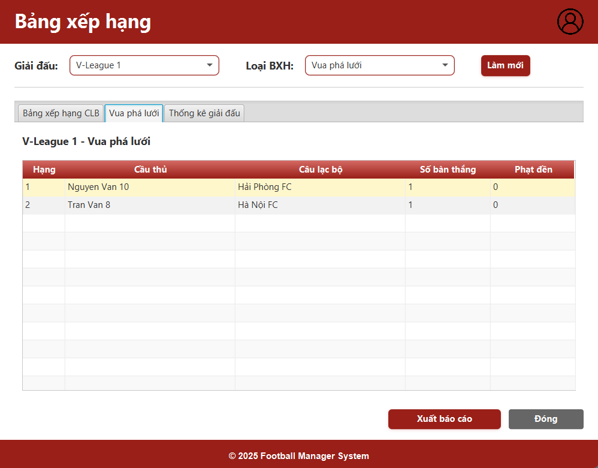
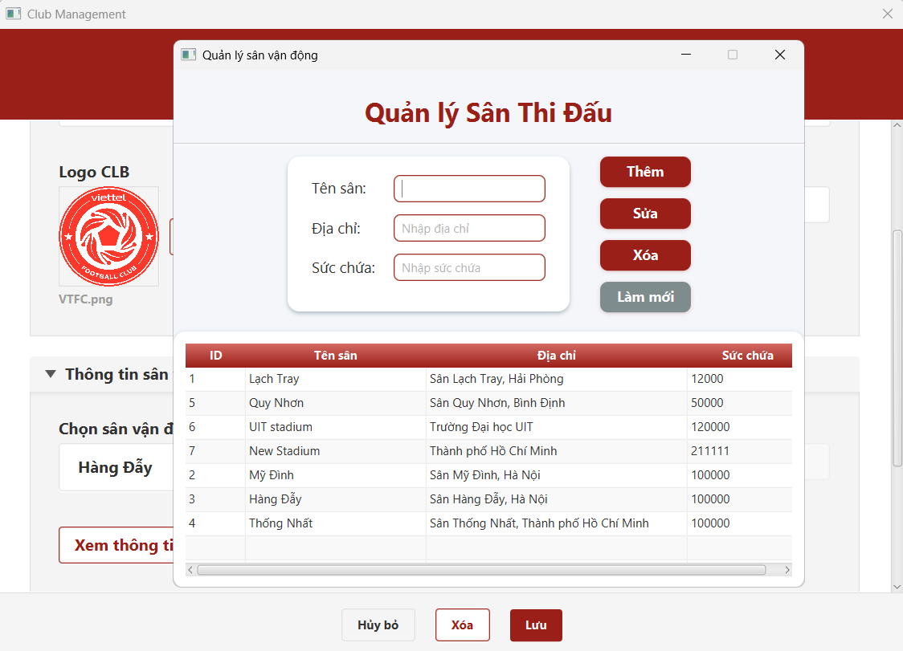
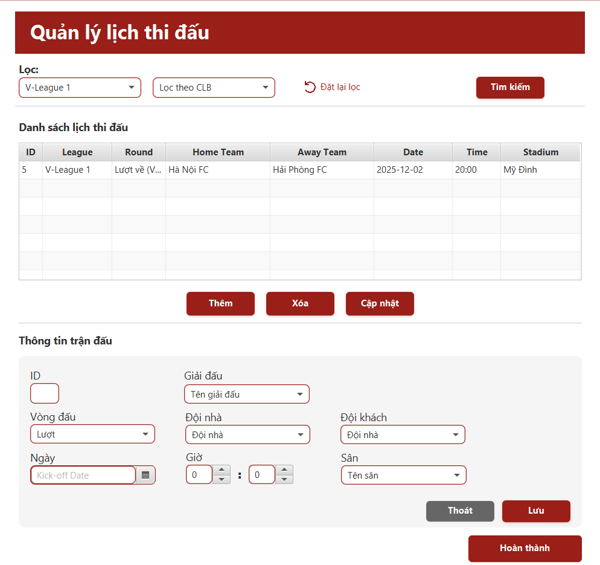

# ⚽ Football Management System-QuackQuack Team


## Giới thiệu đồ án
Đồ án "Hệ thống Quản lý Giải đấu Bóng đá" là một ứng dụng được xây dựng nhằm hỗ trợ công tác tổ chức và điều hành các giải bóng đá một cách hiệu quả và hiện đại. Đồ án không chỉ giúp nhóm vận dụng các kiến thức đã học về lập trình, cơ sở dữ liệu và quản lý dự án mà còn góp phần giải quyết một bài toán thực tế trong lĩnh vực thể thao.

## Mục tiêu của đề tài
Mục tiêu của đề tài là xây dựng một hệ thống quản lý giải bóng đá hiện đại, dễ sử dụng và có tính ứng dụng thực tiễn cao trong mọi môi trường tổ chức thể thao từ phong trào, bán chuyên nghiệp đến chuyên nghiệp. Nhóm thực hiện kỳ vọng mang đến một giải pháp không chỉ tối ưu về mặt kỹ thuật mà còn phù hợp với nhu cầu sử dụng thực tế của các đơn vị tổ chức giải bóng đá trên toàn quốc. Đề tài cũng đặt mục tiêu đảm bảo hệ thống có khả năng tùy biến linh hoạt theo từng mùa giải, hỗ trợ các thể thức thi đấu khác nhau, và tạo ra trải nghiệm quản lý tiện lợi – an toàn – hiệu quả cho người dùng.

## Nhóm Thực Hiện: QuackQuack

| MSSV     | Họ tên                 | Vai trò	     |
|:---------|:------------------------|:-------------|
| 23521305 | Nguyễn Nguyễn Như Quốc	 | Nhóm trưởng	 |
| 23520847 | Lý Phương Linh	         | Thành viên	  |
| 23521312 | Tôn Đại Quốc	           | Thành viên	  |
| 23521318 | Nguyễn Lê Phú Quý	      | Thành viên	  |

### Giảng viên: Tạ Việt Phương


## Mô hình 


---

## Yêu cầu hệ thống

*  Java Development Kit (**JDK 23**)
*  **JavaFX SDK**
*  **Oracle JDBC Driver (ojdbc11)**
*  **Oracle Database**

---

##  Hướng dẫn cài đặt

### 1️⃣ Clone & mở project

```bash
git clone [URL_REPO]
```

* Mở IntelliJ IDEA → **Open Project** → chọn thư mục vừa clone.

### 2️⃣ Thêm thư viện cần thiết

####  Thêm `ojdbc11`

* Vào `File` → `Project Structure` → `Modules` → `Dependencies` → `+` → **JARs or directories** → Chọn file `ojdbc11.jar`.

🔗 Tải `ojdbc11`:
👉 [Download ojdbc11](https://www.oracle.com/database/technologies/appdev/jdbc-downloads.html)

####  Thêm JavaFX

* Vào `File` → `Project Structure` → `Libraries` → `+` → Chọn thư mục `lib` trong JavaFX SDK đã giải nén.

🔗 Tải JavaFX SDK:
👉 [Download JavaFX](https://gluonhq.com/products/javafx/)

* Cấu hình VM options khi chạy:

```sh
--module-path "path/to/javafx-sdk/lib" --add-modules javafx.controls,javafx.fxml,javafx.web
```

---

### 3️⃣ Cài đặt CSDL

* Mở Oracle SQL Developer hoặc môi trường tương đương.
* Tạo user mới:

```sql
CREATE USER c##QLDB1 IDENTIFIED BY 1;
GRANT ALL PRIVILEGES TO c##QLDB1;
```

* Mở file:
  `src/main/java/Database/QLDB1.sql`
  → Chạy toàn bộ nội dung SQL để tạo bảng và dữ liệu mẫu.

---

### 4️⃣ Chạy chương trình

* Chạy file:
  `src/main/java/Test/test.java`

---

### 5️⃣ Đăng nhập hệ thống

| Vai trò                  | Tên đăng nhập        | Mật khẩu |
|--------------------------|----------------------|----------|
| Admin (Full quyền)       | `0`                  | `0`      |
| Ban tổ chức giải đấu     | `admin`              | `123`    |
| Ban quản lý thi đấu      | `admin4`             | `1234`   |
| Ban quản lý CLB          | `admin45`            | `12345`  |
| Ban phân tích & tổng hợp | `admin456`           | `123456` |
| Khách (Guest)            | Bấm `Login as Guest` |          |

---
##  Hướng dẫn sử dụng
### 1️⃣ Giao diện đăng nhập
Đăng nhập vào hệ thống với các vai trò khác nhau để truy cập các chức năng tương ứng. Nếu không có tài khoản, bạn có thể đăng nhập với vai trò khách (Guest) để xem thông tin cơ bản.

### 2️⃣ Giao diện chính
Sau khi đăng nhập, bạn sẽ được chuyển đến giao diện chính của hệ thống. Tại đây, bạn có thể truy cập các chức năng khác nhau tùy theo vai trò của mình.

### 3️⃣ Tra cứu trận đấu
Có thể tra cứu thông tin về các trận đấu theo giải đấu và CLB.


### 4️⃣ Tra cứu kết quả trận đấu
Có thể tra cứu kết quả của các trận đấu đã diễn ra, bao gồm tỷ số và các thông tin liên quan.


### 5️⃣ Tra cứu thông tin cầu thủ
Có thể tra cứu thông tin chi tiết về các cầu thủ, bao gồm tên, vị trí, số áo và các thông tin khác.


### 6️⃣ Tra cứu thông tin CLB
Có thể tra cứu thông tin về các CLB, bao gồm tên, logo, thành viên và các thông tin khác.


### 7️⃣ Tra cứu Bảng xếp hạng
Bảng xếp hạng sẽ hiển thị thứ hạng của các CLB dựa trên kết quả thi đấu của họ. Bạn có thể xem chi tiết về điểm số, số trận thắng, hòa, thua và hiệu số bàn thắng.
Bạn có thể lọc bảng xếp hạng theo từng giải đấu để xem thứ hạng của các CLB trong giải đấu đó.

Ngoài ra còn có Bảng xếp hạng cầu thủ và các thống kê liên quan đến CLB trong giải đấu cụ thể.



### Chức năng của từng vai trò:
#### Ban tổ chức giải đấu
>* Quản lý giải đấu
   >  * Quản lý các thông tin cơ bản giải đấu: tên, logo, ngày khai mạc, ngày kết thúc. Nhấp nút Lưu để lưu thông tin.
        
>* Quản lý vòng đấu
   >  * Sau khi tạo giải đấu,hệ thống hiển thị giao diện quản lý các vòng đấu của giải đấu đó. Nhấp nút Thêm để thêm vòng đấu mới.
        
>* Chỉnh sửa qui định giải đấu
   >  * Cho phép chỉnh sửa các quy định của giải đấu. 
   >  * Nhấp nút Cập nhật qui định để lưu thay đổi hoặc áp dụng qui định mặc định(có sẵn).
     
---
#### Ban quản lý CLB
>* Quản lý thông tin CLB
   >  * Quản lý thông tin CLB có thể thêm/ xóa/ sửa thông tin CLB. Nhấp nút Lưu để lưu thông tin.
        
        
>* Quản lý sân vận động
   >  * Quản lý thông tin sân vận động của CLB, bao gồm tên sân, địa chỉ, sức chứa. Nhấp nút Lưu để lưu thông tin.
        
>* Quản lý cầu thủ
   >  * Có thể mở chức năng quản lý cầu thủ sau khi tạo CLB hoặc ở màn hình chức năng tra cứu đối với vai trò Ban quản lý CLB. 
   >  * Quản lý thông tin cầu thủ có thể thêm/ xóa/ sửa thông tin cầu thủ.
     
>* Quản lý đăng ký thi đấu.
   >  * Quản lý đăng ký thi đấu cho các cầu thủ trong CLB. Có thể thêm/ hủy danh sách đăng ký thi đấu. 
   >  * Tick chọn các cầu thủ muốn đăng ký thi đấu, sau đó nhấp nút Đăng ký thi đấu để đăng ký mới hoặc điều chỉnh danh sách cầu thủ. 
   >  * Ngược lại nhấp nút Hủy đăng ký để hủy đăng ký thi đấu cho CLB tại giải đấu đã chọn.
     
---
#### Ban tổ chức thi đấu
>* Quản lý trận đấu
   >  * Quản lý các trận đấu trong giải đấu, bao gồm tạo mới, sửa đổi và xóa trận đấu.
        
#### Ban phân tích & tổng hợp kết quả
>* Quản lý kết quả trận đấu
   >  * Quản lý kết quả của các trận đấu đã diễn ra, bao gồm cập nhật tỷ số. 
   >  * Cập nhật tỉ số trận đấu sẽ dựa vào số bàn thắng của từng CLB trong trận đấu đó.Nhấp nút Cập nhật để quản lý bàn thắng của trận đấu.
     
>* Quản lý bàn thắng
   >  * Quản lý thông tin bàn thắng của các cầu thủ trong trận đấu, bao gồm đội, cầu thủ ghi bàn, thời gian ghi bàn và loại bàn thắng.
        
>* Xuất báo cáo kết quả
   >  * Xuất báo cáo kết quả của giải đấu, bao gồm thông tin về các trận đấu, kết quả và thống kê.
        
---
## 📂 Cấu trúc thư mục

```
FootballManagementSystem/
├— src/
│   ├— main/
│   │   └— java/
│   │       ├— Model
│   │       ├— Controller
│   │       ├— Database/
│   │       │   └— QLDB1.sql
│   │       ├— Service
│   │       ├— Util
│   │       └— Test/
│   │           └— test.java
│   │   └— Resources/
│   │       ├— CSS
│   │       ├— Icon
│   │       ├— Image
│   │       └— View
├— pom.xml 
└— README.md
```

---

## 📌 Ghi chú

* Đảm bảo `Oracle` đang hoạt động trước khi chạy chương trình.
* Nếu gặp lỗi kết nối, kiểm tra `username/password` và URL kết nối trong code.

---

## 💬 Liên hệ

Mọi góp ý hoặc thắc mắc, vui lòng liên hệ **nhóm phát triển** qua email: nhuquoc1104@gmail.com hoặc GitHub Issues.

---
## Tài liệu kèm theo
* Repository của dự án: [FootballManagerSystem](https://github.com/Ngnquoc1/FootballManagementSystem)
